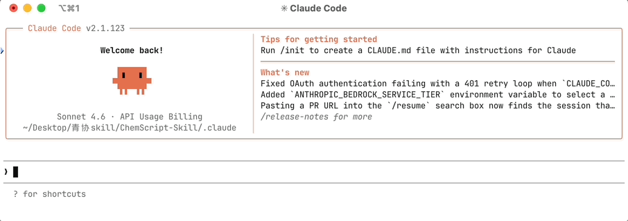
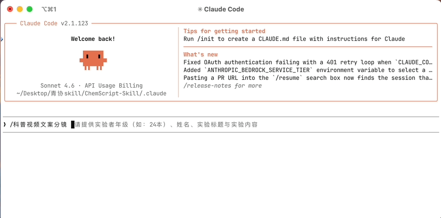
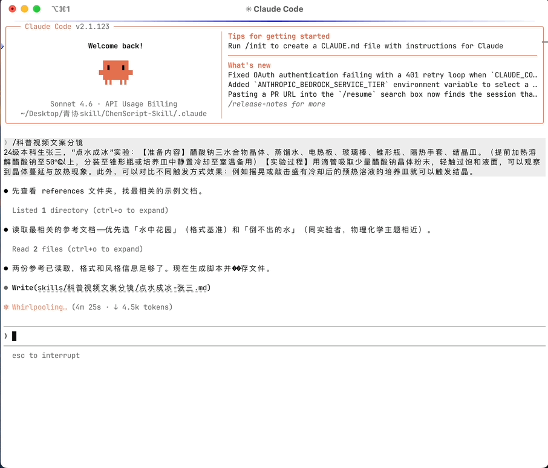

# ChemScript-Skill 使用教程

> **v1.2.1 已发布** — `references/` 新增一篇由 `claude-sonnet-4-6` 和 `DeepSeek-v4-pro` 共同生成并由本人修改过的高质量参考文案：`碘蒸气检测指纹-青小协.md`；此外为避免人物名称太随意导致模型不倾向于参考，将原先两篇 AI 生成文案中的“张三”、“李四”改为了“张三丰”、“李四海”。

🎉 欢迎使用 **ChemScript-Skill** (v1.2.1)！这是一个专门用于撰写生动有趣且兼具科学性的化学科普视频文案与分镜脚本的工具，基于 Claude Code 的自定义 Skill 功能运行。

📦 **仓库地址**：[https://github.com/EricZhangpku/ChemScript-Skill](https://github.com/EricZhangpku/ChemScript-Skill)

💡 **最佳模型推荐**：本 SKILL 深度依赖复杂的指令遵循和长文本生成能力。强烈建议使用 **`claude-sonnet-4-6`**，**`DeepSeek-v4-pro`** 或更强大的模型运行。使用文本生成能力较弱的模型可能会导致格式错乱、AI 风格明显等令人不快的问题。

> 🤖 **“最佳模型推荐”更正说明**：本 SKILL 被开发出来时 `DeepSeek-v4` 刚刚发布不久。当时本人用 `DeepSeek-v3` 相关模型生成的文稿质量远不如 `claude-sonnet` 系列，因此最初的 `README.md` 文档中并不推荐 `DeepSeek` 系列模型。但本人尝试过 `DeepSeek-v4-pro` 后发现其文稿生成质量已经比肩甚至超过了 `claude-sonnet-4-6`，而且价格实惠得多。故在此强烈推荐使用 `DeepSeek-v4-pro` 的 API 进行本 SKILL 的文稿生成工作。

---

## 📁 目录结构与说明

本仓库的核心内容按照 Claude Code 的规范组织，主要结构如下：

```text
ChemScript-Skill/
└── .claude/                # Claude Code 工作目录（推荐在此目录下运行）
    ├── README.md           # 本使用教程文档
    ├── assets/             # 内含本文档所需 GIF 资源
    └── skills/
        └── 科普视频文案分镜/
            ├── SKILL.md    # 核心技能文档：定义了 AI 的扮演角色、生成逻辑、文案结构和限制条件
            ├── references/ # 参考案例库：用于让 Claude 模仿的优秀标准文案
            │   ├── 碘蒸气检测指纹-青小协.md
            │   └── ...     # 其他参考文档
            └── （生成的 md 的最终保存位置：与 SKILL.md 同级目录）
```

*注：`references` 文件夹中的“张三丰”“李四海”“青小协”等非真实人名的文档，是作者使用* `claude-sonnet-4-6` *及* `DeepSeek-v4-pro` *生成后进行人工微调得到的标准范例，可以作为生成效果的范例参考。*

---

## 🛠️ 准备工作

由于本工具基于代码仓库和命令行运行，你需要具备基础的 Git 和 Claude Code 环境。如果你没有任何经验，请按照以下步骤操作：

### 1. 下载并安装 Git
Git 是用来把云端代码仓库下载到你电脑上的工具。
- **Windows 用户**：前往 [Git 官网 (git-scm.com)](https://git-scm.com/download/win) 下载安装程序，一直点击“下一步”进行默认安装即可。
- **Mac 用户**：打开电脑自带的“终端 (Terminal)”，输入 `git --version` 并回车。如果没有任何提示，系统会弹窗引导你安装命令行开发者工具，点击确认安装即可。

### 2. 安装并配置 Claude Code
本 SKILL 必须在 Claude Code 命令行工具中运行。请确保你已经全局安装了 Claude Code，并且已经成功配置并登录了你的 Anthropic API 账号（或相应的授权）。这一步需要你有可用的终端和 Node.js 环境。配置 Claude Code 的教程很容易在互联网上搜索得到。

---

## 🚀 使用流程

### 1. 将仓库克隆到本地
打开终端（Windows 的 `cmd` 或 `PowerShell`，Mac 的 `Terminal`），使用 `cd` 命令进入你想要存放本文件夹的位置，例如桌面：
```bash
cd Desktop
```
然后输入以下命令将仓库克隆下来：
```bash
git clone https://github.com/EricZhangpku/ChemScript-Skill.git
```

### 2. 进入正确的目录
**⚠️ 注意：你只能在 `.claude` 文件夹下才能正确使用并触发本 skill！**
在终端中继续输入：
```bash
cd ChemScript-Skill/.claude
```

### 3. 打开 Claude Code 并激活 Skill
在当前目录下输入 `claude` 并敲下回车，打开交互界面。
在界面底部的输入框中，输入以下内容并敲下**空格键**：
```text
/科普视频文案分镜 
```
此时，界面会弹出提示：
> *"请提供实验者年级（如：24本）、姓名、实验标题与实验内容"*



### 4. 生成文案
根据弹出的提示，输入你的实际实验信息（步骤不要太简略，最好带上现象描述）并敲下回车，之后按照界面的指引来做即可。最终生成的 `.md` 格式文件，会自动保存在与 `references` 同级的文件夹下。



AI 生成好文案后会自动弹出并询问是否写入文件：



> ##### **不建议使用 Claude Code 的 `acceptEdits` 或 `auto` 模式进行生成：**
> 采用 `默认审批` 模式时 AI 每修改一句话都会询问用户“是否接受修改”，你可以随时打断并提出意见；而在上述这些模式下 AI 会自动生成/修改**全部**内容并直接写入文件，如果对某处生成或修改不满意，无法像 `默认审批` 模式一样随时打断，只能等它工作完后再进行修改，效率会大打折扣，且会使 token 的消耗量大大增加。


---

## 🔄 进阶：指导 AI 修改与迭代 Skill

**1. 结果不满意时可以选择 reject 并提出修改建议**

生成过程中，当 Claude Code 询问提示你 **“是否写入文件”**（或确认执行工具调用）时，如果你觉得某个地方写得不满意，你可以选择 **No**（拒绝），然后直接在聊天框中提出你的修改建议（例如：“结尾的升华太生硬了，请换一个更贴近生活的例子”），直到它生成出令你完全满意的文案为止。

**2. 让 Skill 自我进化**

在与 Claude Code 交互完毕，成功生成满意的脚本后，你可以通过一句话让 Claude 总结经验，**永久提升这个 Skill 以后生成的效果**。
请对 Claude Code 发送类似下面的表述：
> *"请总结我们刚才在对话中修改文案的过程和我提出的针对性意见，将这些新的注意事项和要求补充并迭代进你本机的 `SKILL.md` 指令文档中，以优化未来的生成效果。"*

---

## ⚠️ 郑重提醒

**请务必仔细检查 Claude Code 生成的文案内容！**

AI 生成的实验操作步骤和实验现象描述，有时候可能与真实的化学操作规程存在差异，甚至画蛇添足。
- **例如**：在制作“大象牙膏”实验时，真实的实验中我们直接向量筒内的混合液中倒进 KI 固体，**无需搅拌**就能涌出大量泡沫并获得极佳的视觉效果；但是 Claude Code 在初次生成时，很可能会按照常规化学操作习惯擅自加上“搅拌”这一多余的步骤。
- **应对方法**：生成后一定要结合自己的真实操作经验进行通读。遇到不符实际的操作，你可以直接手动在最后生成的 md 文件里进行改正，或者在对话中让 Claude Code 自行改正。

*此外，结尾的升华段一直是 AI 生成的薄弱项，如果你觉得它写得不够好，又比较珍惜 tokens 的情况下，建议自行修改润色。*

希望本 Skill 能够帮助你高效地生成符合要求的化学科普视频文案分镜脚本，创作出更多有趣又科学的内容！如果你有任何关于使用或改进这个 Skill 的建议，欢迎随时向作者提出！